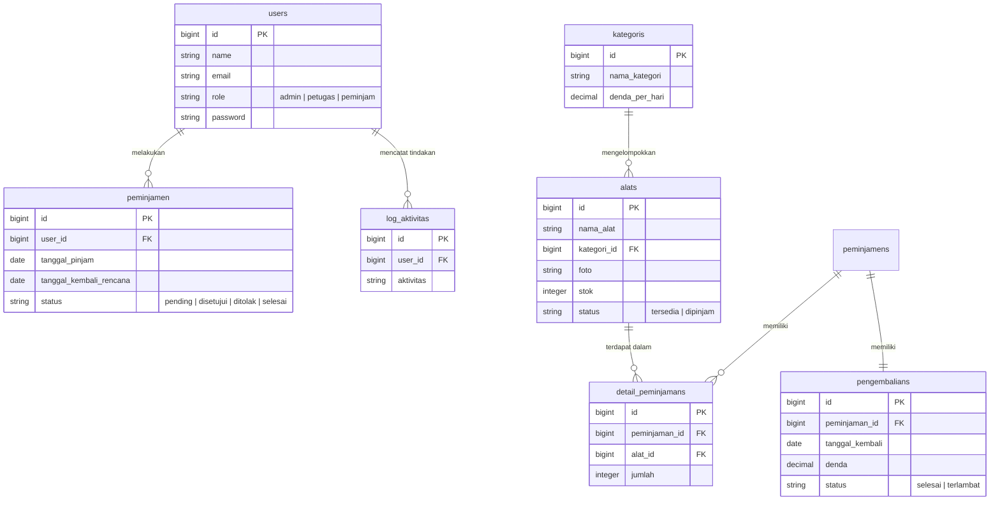

# 📡 VEND - Sistem Manajemen & Peminjaman Alat Real-Time

VEND adalah aplikasi web modern berbasis **Laravel 11**, **TailwindCSS**, dan **Pusher WebSockets** yang dirancang untuk mengelola inventaris, peminjaman, serta pengembalian alat secara instan (**real-time**) dengan antarmuka premium berkelas industri.

Aplikasi ini memiliki pembagian peran yang ketat (*Role-based Access Control*) serta dilengkapi efek suara premium (*Native Audio Chime*) dan *Glassmorphic Toast Notification* tanpa membebani performa browser.

---

## 🚀 Fitur Utama

### 1. ⚡ Real-Time WebSockets (Pusher Integration)
* **Sisi Petugas:** Menerima notifikasi instan bertuliskan *"Peminjaman Baru! 📡"* beserta bunyi bel chime (E5 -> A5) dan penyisipan baris data baru ke tabel persetujuan secara otomatis tanpa perlu melakukan refresh halaman saat ada peminjam yang mengajukan alat.
* **Sisi Peminjam:** Menerima notifikasi instan berupa Toast melayang *"Pengajuan Disetujui! 🎉"* atau *"Pengajuan Ditolak ❌"* lengkap dengan efek suara khusus begitu petugas menekan tombol aksi. Halaman Dashboard & Riwayat Peminjam juga otomatis memudarkan/memperbarui status data secara dinamis.

### 🔊 2. Premium Audio Chime (Web Audio API)
* Tidak menggunakan file suara `.mp3` atau `.wav` eksternal yang lambat di-load.
* Menggunakan **Web Audio API native browser** (ukuran beban 0 KB) yang secara dinamis mensintesis gelombang frekuensi suara manis lonceng ganda untuk sukses/disetujui, dan suara buzzer frekuensi rendah untuk alarm/ditolak.

### 👥 3. Alur Persetujuan & Workflow Approval
* Sistem alur persetujuan terintegrasi di mana **Petugas dapat meninjau, menerima, atau menolak** permintaan peminjaman alat secara langsung. 
* Status transaksi dan riwayat peminjaman otomatis ter-update secara aman dan dinamis.

### 💰 4. Kalkulasi Denda Otomatis (Automatic Late Fines)
* Menghitung denda secara otomatis jika peminjam mengembalikan alat melebihi tanggal rencana kembali yang ditentukan.
* Nilai denda dikalkulasi secara presisi **berdasarkan tarif kategori alat** dan **durasi jumlah hari keterlambatan** pengembalian.

### 📑 5. Cetak Laporan PDF & Manajemen User (Admin Panel)
* **Ekspor Laporan:** Mengintegrasikan fitur cetak laporan riwayat peminjaman ke dalam dokumen **PDF berkualitas tinggi** untuk kebutuhan arsip, audit, dan pelaporan berkala.
* **Manajemen User:** Akses khusus Admin untuk mengelola akun pengguna, hak akses peran (*roles*), kategori barang, serta log aktivitas sistem.

### 📊 6. Integrasi Inventaris & Log Aktivitas (Audit Trail)
* **Sinkronisasi Stok Otomatis:** Jumlah stok alat otomatis terpotong saat pengajuan disetujui, dan bertambah kembali ketika pengembalian telah diverifikasi oleh petugas, mencegah terjadinya *over-borrowing*.
* **Log Aktivitas:** Setiap aksi penting (pengajuan, persetujuan, penolakan, pengembalian) tercatat secara kronologis dalam sistem log aktivitas yang rapi sebagai *audit trail*.

---

## 🛠️ Tech Stack

* **Backend:** Laravel 11.x (PHP 8.2+)
* **Frontend:** Laravel Blade, TailwindCSS (Glassmorphism & premium UI details), Vanilla JavaScript
* **Database:** MySQL / PostgreSQL (Production), SQLite (Local Testing)
* **WebSockets Service:** Pusher Channels
* **Audio Engine:** Browser Native Web Audio API

---

## 📊 Struktur Database & Skema Relasi (ERD)

Untuk menjamin integritas data inventaris dan pencatatan audit trail yang akurat, sistem database VEND dirancang menggunakan relasi relasional yang ketat:



---

## ⚙️ Cara Instalasi & Konfigurasi Lokal

Ikuti langkah berikut untuk menjalankan VEND di komputer lokal Anda:

### 1. Clone Repositori
```bash
git clone https://github.com/dhitoafrian/vend.git
cd vend
```

### 2. Pemasangan Dependensi
Instal pustaka backend (Composer) dan frontend (NPM):
```bash
composer install
npm install
```

### 3. Konfigurasi Lingkungan (`.env`)
Salin file konfigurasi `.env` bawaan:
```bash
cp .env.example .env
```
Buka file `.env` baru Anda, lalu sesuaikan bagian database serta **Pusher Credentials** Anda:
```env
BROADCAST_CONNECTION=pusher

PUSHER_APP_ID="your_pusher_app_id"
PUSHER_APP_KEY="your_pusher_app_key"
PUSHER_APP_SECRET="your_pusher_app_secret"
PUSHER_APP_CLUSTER="your_pusher_app_cluster"

# Pengaturan Bypass SSL Lokal (Khusus Windows / Laragon)
PUSHER_SCHEME=http
PUSHER_PORT=80
```

### 4. Generate Application Key & Database Migration
```bash
php artisan key:generate
php artisan migrate --seed
```
*(Perintah seed akan otomatis membuatkan akun percobaan untuk Admin, Petugas, dan Peminjam).*

### 5. Jalankan Aplikasi
Buka dua terminal terpisah lalu jalankan server Laravel dan bundler Vite:

**Terminal 1 (Laravel Server):**
```bash
php artisan serve
```

**Terminal 2 (Vite Compiler):**
```bash
npm run dev
```

Aplikasi kini dapat diakses di `http://127.0.0.1:8000` atau domain lokal Laragon Anda!

---

## ☁️ Catatan Penting Untuk Deployment Produksi (Railway / Heroku)

Sistem penyiaran VEND dirancang **sangat cerdas dan adaptif** terhadap lingkungan (*Environment-Safe*):

1. **Keamanan SSL Otomatis:**
   * Di **Lokal (Laragon)**, aplikasi menggunakan jalur tidak aman HTTP Port 80 untuk memintas error sertifikat PHP (`cURL error 77`).
   * Di **Produksi (Railway)**, Anda **tidak perlu** mengatur `PUSHER_SCHEME` dan `PUSHER_PORT` pada tab Variables Railway. Aplikasi secara otomatis akan mendeteksi dan beralih ke jalur aman **HTTPS (Port 443)** demi keamanan transaksi data.
2. **Skalabilitas & Manajemen Antrean (Synchronous vs Asynchronous Queue):**
   * **Konfigurasi Demo & Free-Tier:** Di dalam berkas event `PeminjamanDiajukan` dan `PeminjamanStatusDiperbarui`, aplikasi ini menggunakan implementasi `ShouldBroadcastNow`. Hal ini sengaja dipilih untuk mempermudah proses **pengujian lokal** dan **demo/free-tier hosting** (seperti Railway Free Plan) agar notifikasi real-time terkirim secara instan tanpa memerlukan server Queue worker tambahan (`php artisan queue:work`) yang memakan resource memori konstan.
   * **Rekomendasi Skala Industri (Production):** Untuk deployment berskala besar dengan trafik tinggi, sangat direkomendasikan untuk mengubah implementasi interface dari `ShouldBroadcastNow` menjadi `ShouldBroadcast` biasa. Perubahan ini akan mengalihkan proses panggilan API pihak ketiga (Pusher) menjadi *asynchronous* melalui antrean antarmuka (Queue) menggunakan database/Redis. Hal ini menjaga aplikasi utama tetap responsif dan mencegah hambatan loading jika jaringan server Pusher eksternal mengalami kelambatan atau kegagalan koneksi.

---

## 👥 Akun Percobaan (Default Seed)
* **Admin:** `admin@vend.test` (Password: `password`)
* **Petugas:** `petugas@vend.test` (Password: `password`)
* **Peminjam:** `peminjam@vend.test` (Password: `password`)
